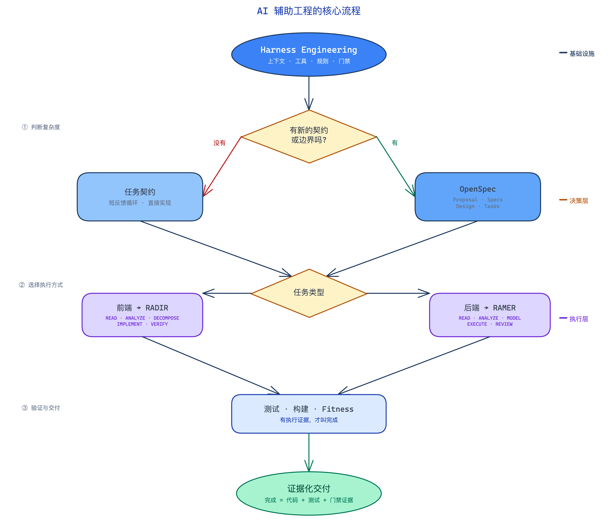
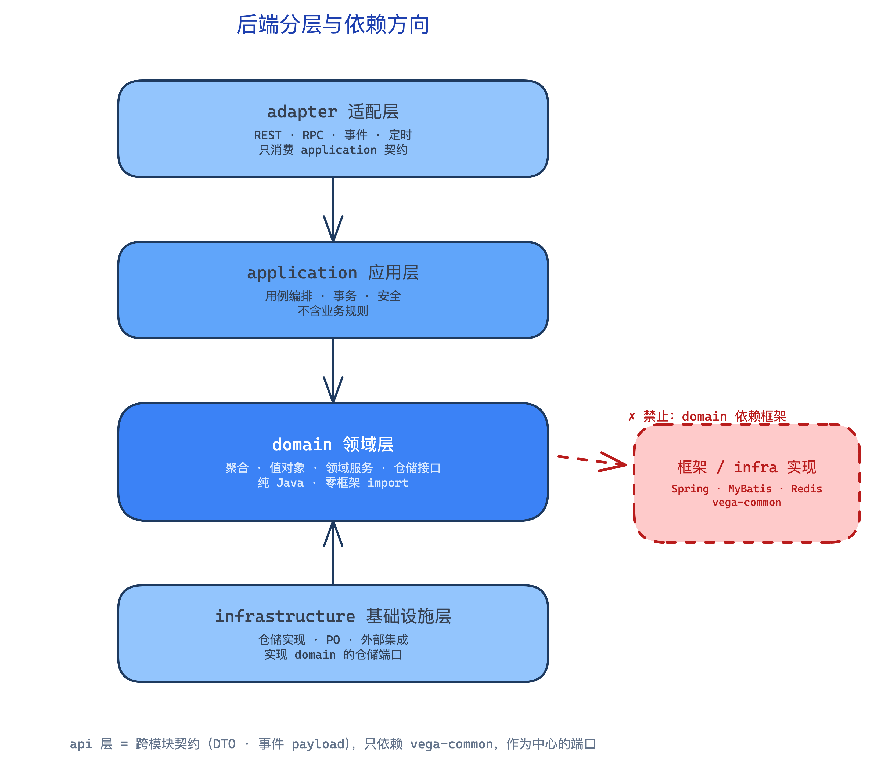
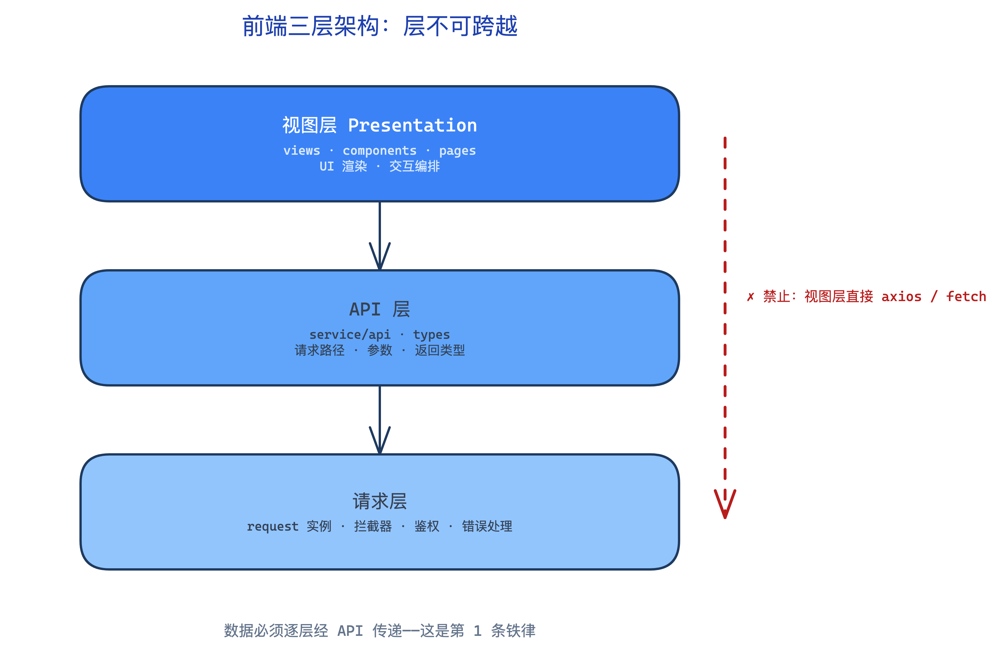
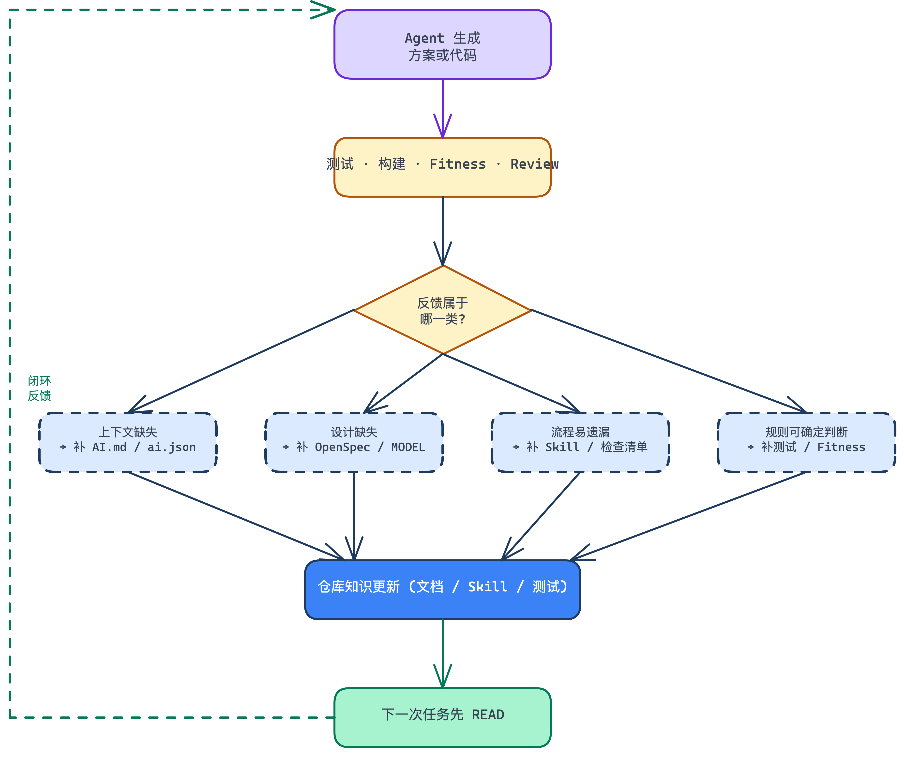
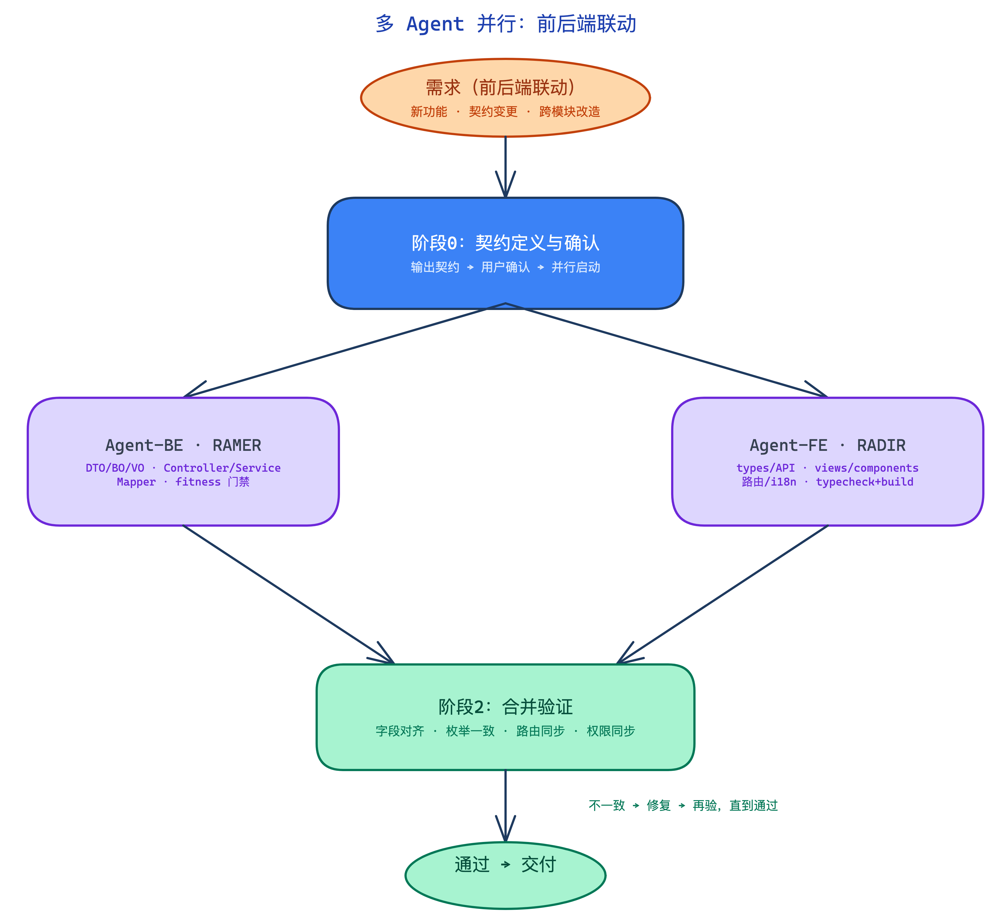
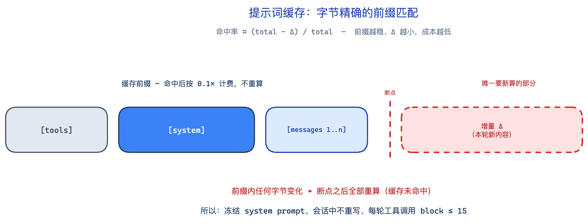
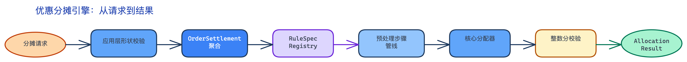

# AI-Assisted Development Methodology

A complete engineering methodology for integrating AI Coding Agents into the software development lifecycle. Stack-agnostic, scale-adaptive.

> **Language**: [中文文档](README.zh.md) | English

---

## Quick Start

Deploy this methodology into a new project in two steps:

### Step 1: Run the Init Script

Open the terminal in **Claude Code** / **Codex** / **Cursor** and run:

```bash
bash docs/methodology/scripts/init.sh --tier 1
```

The script handles file copying and directory creation (idempotent — safe to re-run).

### Step 2: Let the Agent Complete Configuration

In the same session, tell the agent:

```
Fill the {{placeholders}} in CLAUDE.md and openspec/config.yaml based on
the actual project. Draw the module dependency diagram, fill in build
commands and conventions.
```

The agent will:
1. Read the project structure (`package.json`, `pom.xml`, directory tree, etc.) to auto-detect the tech stack and build commands
2. Replace all `{{PLACEHOLDER}}` instances in `CLAUDE.md` and `openspec/config.yaml`
3. Draw a module dependency diagram (ASCII art)
4. Verify mandatory skill availability
5. Run `--check` to confirm completeness

### Common Commands

```bash
bash docs/methodology/scripts/init.sh --tier 1     # Minimum viable (recommended start)
bash docs/methodology/scripts/init.sh --tier 2     # Add Fitness quality gate
bash docs/methodology/scripts/init.sh --tier 3     # Add RAMER Agent + CI integration
bash docs/methodology/scripts/init.sh --check      # Verify current setup status
bash docs/methodology/scripts/init.sh --dry-run    # Preview without modifying
```

| Tier | Time | Script Creates | Agent Completes |
|------|------|---------------|-----------------|
| 1 | 5 min | CLAUDE.md + OpenSpec + Superpowers + mandatory-skills + fe-engineering | Fill placeholders, module diagram, build commands, tech stack |
| 2 | +10 min | Fitness scripts + rules + SDD docs + root path document | Replace fitness parameters, add conventions |
| 3 | +15 min | RAMER Agent + CI hints | Configure CI pipeline, E2E tests |

> The script is **idempotent** — re-running won't overwrite existing files. For detailed manual steps, see [TRANSPLANT.md](TRANSPLANT.md).

---

## The Story in One Page

The whole methodology boils down to one insight: **engineering is turning "rules in people's heads" into "rules in the repository."** The four concepts stack into layers:

| Layer | Concept | Role |
|-------|---------|------|
| Infrastructure | **Harness Engineering** | Combines context, tools, rules, and gates into an Agent-runnable environment |
| Decision layer | **OpenSpec** | Records high-cost decisions: what, why, boundaries, trade-offs |
| Execution layer | **RAMER** (backend) / **RADIR** (frontend) | Reliable loops from requirement to code, verified by gates |

**Engineering delivery vs. direct generation:**

| Dimension | Direct generation | Engineering delivery |
|-----------|-------------------|----------------------|
| Starting point | One natural-language sentence | Goal, scope, constraints, acceptance, non-goals |
| Context | Agent searches ad-hoc | Path documents, real code, call chains |
| Design | Improvised while coding | Contract, responsibilities, and dependency direction confirmed first |
| Done means | Code generated / compiles | Tests, build, and gates show evidence |
| Fits | Low-risk local edits | New capability, cross-module, interface/architecture change |

**Three takeaways:**

1. **Model complex requirements before coding** — settle contracts, objects, and responsibilities before letting the Agent write
2. **Code generation is not done** — tests, build, and gates must carry evidence
3. **Sink lessons into the repository** — every mistake is a chance to improve the environment, not to repeat it

---

## Core Concepts

Four mutually supporting concepts:

| Concept | Solves |
|---------|--------|
| Harness Engineering | The Agent's engineering environment: how context, rules, tools, and gates combine |
| OpenSpec | Recording high-cost decisions: what, why, boundaries, trade-offs |
| RAMER | Backend execution loop: `READ → ANALYZE → MODEL → EXECUTE → REVIEW` |
| RADIR | Frontend execution loop: `READ → ANALYZE → DECOMPOSE → IMPLEMENT → VERIFY` |



Their relationship: **Harness is the infrastructure, OpenSpec is the decision layer, RAMER/RADIR are the execution layer.**

---

## Backend Engineering: RAMER & Iron Rules

The core challenge of backend engineering is **business logic scattering across Services, and module boundaries / dependency directions getting out of control**. The RAMER loop plus a few iron rules turn "what counts as acceptable backend code" into checkable rules.



| Iron rule | Content | Check |
|-----------|---------|-------|
| Contract-first | Controller / Remote in/out params must be DTO / BO / VO, never Entity; mapping only in the Controller layer via MapStruct | `grep` Controller for Entity params |
| Dependency direction | `adapter → application → domain ← infrastructure`; domain is pure Java, zero framework imports | `grep` domain for framework annotations |
| Polymorphism over branching | Nested `if/else` ≥ 2 or `switch` ≥ 3 → Strategy / Factory / Handler; inheritance depth ≤ 1 | Code review |
| Gate evidence | Done means tests, build, and Fitness carry evidence; three-phase debug-log self-check | fitness gate |

**Layer responsibilities:**

| Layer | Responsibility | Forbidden |
|-------|----------------|-----------|
| `domain` | Pure Java aggregates / value objects / domain services / repository interfaces | Depending on Spring / Redis / MyBatis / frameworks |
| `application` | Use-case orchestration, transaction boundaries, security | Containing business rules |
| `infrastructure` | Repository implementations, PO, external integrations (implements domain ports) | Reversing into upper-layer details |
| `adapter` | REST / RPC / event / scheduled adapters (only consume application contracts) | Containing business logic |

---

## Frontend Engineering: RADIR & Four Iron Rules

The core challenge of frontend engineering is that **view, state, and data-flow layers easily mix together**. Four iron rules turn "what counts as acceptable frontend code" into checkable rules, framework-agnostic.



| Iron rule | Content | Check |
|-----------|---------|-------|
| Layers are non-negotiable | View layer must not call `axios` / `fetch` / low-level `request` directly; data goes through the API layer | `grep` view dirs for low-level requests |
| Types are the contract | No `any`; when API fields change, types, API, and pages update in the same task; enums follow the backend | `tsc --noEmit` / `vue-tsc --noEmit` |
| Components are controlled | Single file ≤ 300 lines; modals / forms / tables split into independent components | `wc -l` + directory check |
| Three-state coverage | Every data-fetching scenario handles loading / empty / error explicitly | Code review + template check |

**Component decomposition**: parent components only orchestrate (≤ 150 lines), child components implement (≤ 300 lines). Business components start in page `modules/`; promote to shared components only when used by 3+ places — **no premature abstraction**.

Frontend quality gates: `typecheck → build → gen-route → lint`.

---

## Feedback Loop: Making the Project Better Over Time

Engineering is not a one-time setup — it is a continuous process of **learning from errors and sinking the fix into the environment**. Every Agent mistake is an opportunity to improve the engineering environment.



| Recurring problem | Sink location | Effect |
|-------------------|---------------|--------|
| Agent doesn't know module responsibilities | Path `AI.md` / `ai.json` | Next session automatically gets context |
| Complex requirements go straight to implementation | OpenSpec & MODEL confirmation point | Forces design-before-code |
| Rules keep ending up in `ServiceImpl` | RAMER Skill, architecture examples, size gate | Guides toward model-driven |
| DTO / permission / dependency-direction mistakes repeat | Fitness Hard Gate | Automatically blocks common errors |
| Edge cases always missed | Automated tests | Tests as spec, prevent regression |

**Five key judgments:**

| Judgment | How to apply |
|----------|--------------|
| Prompt isn't enough as complexity grows | Put stable rules into the repository |
| The more complex the requirement, the more you model first | Contract, objects, responsibilities, and change axis first |
| File splitting is not architecture | Confirm the model, then let boundaries naturally become files |
| Code generation is not completion | Tests, build, Fitness, and review must show evidence |
| AI's long-term value comes from feedback | Sink recurring problems into docs, skills, tests, and gates |

---

## Multi-Agent Parallel: Frontend-Backend Coordination

When a task touches both frontend and backend, split at the API contract boundary and run dual agents in parallel to save wall-clock time.



| Phase | Action | Output |
|-------|--------|--------|
| Phase 0: Contract definition | Main agent extracts the shared contract: API endpoint/method, request/response fields + types, enums/status codes; **confirm with the user first** | Contract summary |
| Phase 1: Parallel implementation | Agent-BE follows RAMER, Agent-FE follows RADIR, launched in background simultaneously | Backend + frontend code |
| Phase 2: Merge verification | Main agent aligns fields / enums / routes / permissions; mismatch → fix → re-verify | Passing gates |

**The contract is the foundation**: confirm it with the user before launching the two agents, or mid-change contract edits force both sides to sync. **Single-side tasks** use the corresponding workflow directly; degrade to sequential when sub-agents are unavailable.

---

## Context Capability & Prompt Caching

Engineering improves not only quality but also cost. LLM server-side caching is a **byte-exact prefix match**: as long as the request prefix is unchanged, cached parts bill at roughly 0.1×. In an agentic coding loop, each request ≈ previous session + a small delta (Δ), so hit rate ≈ `(total − Δ) / total` — the more stable the prefix and the smaller the Δ, the lower the cost.



**Three practices that keep the prefix stable and Δ small:**

| Practice | Effect |
|----------|--------|
| Freeze the system prompt (CLAUDE.md loaded deterministically, versioned) | Byte-identical prefix every request, hits from the first request |
| Use docs as a map, read targeted, so compaction rarely triggers | History is never rewritten, Δ stays small |
| Deterministic workflow, consolidated tool calls | ≤ ~15 tool-call blocks per turn, inside the cache breakpoint lookback window |

**Five-dimension context capability model:**

| Dimension | Mnemonic | Solves |
|-----------|----------|--------|
| Window & compression | 装得下 | Context that runs out of room |
| Cross-session memory | 记得住 | Context lost between sessions |
| Injection precision | 装得准 | Context too broad to be useful |
| Caching efficiency | 用得省 | Repeatedly re-processed at full price |
| Reasoning depth per token | 想得深 | Output quality per token consumed |

**Operational discipline**: never rewrite the top-level system prompt mid-session — append a `{"role":"system"}` message instead when conventions need updating.

---

## Onboarding Tutorial: Run the Full Pipeline with a Demo

The following walkthrough shows **how the engineering methodology changes the implementation path and the final result**, using a real case (an **enterprise multi-scenario order discount allocation engine**).

### Step 1: Put the Methodology Into a Project

```bash
bash docs/methodology/scripts/init.sh --tier 2
```

Or initialize in one step with Claude Code: `/init init from /docs/harness-engineering-kit`

Confirm the four entry points exist:

| Entry | Purpose |
|-------|---------|
| `CLAUDE.md` / `AGENTS.md` | Global agent conventions, module diagram, commands |
| `AI.md` + `ai.json` | Path-level responsibilities, allowed dependencies, local facts |
| `openspec/config.yaml` | SDD change directory and rules |
| `docs/fitness/` | Quality dimensions, executor, verification ledger |

### Step 2: Test with a Complex Requirement

The demo is an **enterprise multi-scenario order discount allocation engine** — chosen for real-engineering challenges: rules keep growing, rules compose, and money precision must be consistent.

| Scenario | Key rule |
|----------|----------|
| Retail | Proportional allocation by net amount, each item capped at its own discountable amount |
| Cross-border | Deduct tax and shipping first, then proportional allocation, item cap at 30% |
| Flash sale | Allocate by quantity, remainder to the last item |
| Group buy | Error if the group isn't formed; low-price items first, remainder by proportional allocation |
| Member-exclusive | Deduct points first (max 50% of total discount), remainder reuses the retail rule |

### Step 3: Freeze Decisions with OpenSpec

```text
/opsx:propose <requirement>
```

Use Plan mode so the Agent surfaces boundary questions before implementing. Four artifact types are generated:

```text
openspec/changes/order-discount-allocation/
├── proposal.md                         # Why, what's affected, non-goals
├── design.md                           # Architecture choices, rule table, package structure, risks
├── tasks.md                            # Dependency-ordered implementation tasks
└── specs/discount-allocation/spec.md   # Requirements, constraints, WHEN/THEN scenarios
```

### Step 4: Read the Model from the Spec

This is RAMER's MODEL phase — extract the domain model and rule model from the spec:



**Key decisions:**
- `switch` ≥ 3 → Strategy/Registry (polymorphism over branching)
- Money stored as integer cents internally, two decimals on output (precision consistency)
- Business errors returned via `AllocationResult`, not exceptions (errors as values)
- New scenario = new enum + registered rule spec, core unchanged (open/closed)

### Step 5: Implement per Tasks and Verify

```text
/opsx:apply order-discount-allocation
```

```bash
python3 docs/fitness/scripts/fitness.py --tier fast
mvn -q compile
mvn test
```

**Three-phase debug logging**: add temporary logs at branch entries / state transitions / external calls while coding → self-check the actual data flow item by item when running tests (right branch taken, status A→B, params match contract) → clean up temporary output and keep framework business logs after passing.

> Green tests ≠ correct behavior: tests only prove nothing crashed; log self-checks prove the behavior is right.

**Boundary awareness**: the spec explicitly excludes REST, DB migration, and real tax-rate calculation. An Agent adding a Controller or Mapper on its own crosses the non-goals — this validates the value of "non-goals" in OpenSpec.

### Step 6: What "Done" Means After Adoption

Engineering delivery's "done" is not code generation — it is **the whole system keeps working**:

- Agent can state module structure, dependency direction, and build commands
- Non-trivial requirements first generate Proposal, Design, Specs, and Tasks
- Reads the nearest `AI.md` and `ai.json` before modifying code
- On Fitness failure, points to the file, rule, cause, and fix entry
- Failure feedback is written back into docs, skills, tests, or gates for next time

Full lifecycle: `Propose → Apply → Verify → Sync → Archive`

---

## Who Needs This

- **Tech Leads** — Elevate AI coding from "individual skill" to "team engineering capability"
- **Developers** — Quickly establish an AI-assisted development workflow in new projects
- **Teams** — Need a replicable, verifiable methodology portable across projects

## Core Principles

1. **Documentation first, design second, implementation last** — Don't touch code without reading path documents
2. **Contract-first** — Define interfaces/DTOs, confirm design, then implement
3. **DDD as skeleton** — Strategic (bounded context) sets boundaries; tactical (aggregates/entities/events) sets structure
4. **Composition over inheritance** — Inheritance depth ≤ 1, prefer DI + composition
5. **Polymorphism over branching** — Nested `if/else` ≥ 2 or `switch` ≥ 3 → Strategy/Factory/Handler
6. **Three-phase debug logging** — Log after coding, self-check expectations via tests, clean up temporary logs
7. **Completion conditions must be executable** — Rules in the repo, readable by humans, executable by scripts
8. **Frontend-backend parallel execution** (`core/multi-agent.md`) — After contract definition, dual agents develop in parallel, then merge and verify
9. **Complete Agent Skill configuration** — Agent must have OpenSpec, Superpowers, and Codegraph; missing any means degraded capability
10. **Context Capability & Prompt Caching** (`core/context-capability.md`) — Keep the prompt prefix byte-stable and the per-request delta small; five-dimension context capability model (window, memory, injection, caching, reasoning depth)

## Directory Structure

```
docs/methodology/
├── README.md                           # English entry (this file)
├── README.zh.md                        # Chinese entry
├── LICENSE                             # MIT
├── CONTRIBUTING.md                     # Contribution guide
├── CHANGELOG.md                        # Version history
├── VERSION                             # 0.1.0
├── .github/                            # Issue/PR templates
├── assets/                             # Diagrams referenced by this README
│   └── ai-coding-engineering-tutorial/
├── scripts/
│   └── init.sh                         # One-click init script
├── core/                               # Universal principles (English, stack-agnostic)
│   ├── ramer-cycle.md                  # RAMER Cycle
│   ├── ramer-agent.md                  # RAMER Agent automation
│   ├── abstraction-first.md            # Abstraction-first modeling
│   ├── ddd-modeling.md                 # Domain-Driven Design modeling
│   ├── debug-log-discipline.md         # Debug log discipline
│   ├── frontend-architecture.md        # AI-native frontend architecture (AIDM + FDD + RSC)
│   ├── frontend-engineering.md         # Frontend engineering capability model (4 iron rules + component decomposition)
│   ├── multi-agent.md                  # Multi-agent parallel mode (frontend-backend coordination)
│   ├── mandatory-skills.md             # Mandatory Skill configuration
│   ├── sdd-workflow.md                 # SDD workflow
│   ├── fitness-framework.md            # Fitness quality gate
│   ├── context-capability.md           # Context capability & prompt caching
│   └── harness-engineering.md          # Harness engineering
├── i18n/
│   ├── glossary.md                     # Terminology reference (zh ↔ en)
│   └── zh/core/                        # Chinese translations (13 files)
├── examples/
│   └── coil-backend-api/               # Adaptation example: Java Spring Boot + Vue 3 monorepo
└── templates/                          # Copy-and-use templates
    ├── CLAUDE.md.template              # AI entry config
    ├── openspec-config.yaml.template   # SDD config
    ├── sdd-readme.md.template          # SDD process doc
    ├── path-document.md.template       # Path document (AI.md + ai.json)
    ├── fitness/                        # Fitness checks, executable self-tests, Java AST scanner, rules
    ├── ramer/                          # RAMER Agent templates
    ├── multi-agent/                    # Claude/Codex multi-agent parallel skill template
    ├── compaction/                     # Claude hooks + explicit Codex preservation fallback
    ├── fe-engineering/                 # Frontend engineering integration templates
    └── mandatory-skills/               # Mandatory Skill declaration templates
```

## Relationship with VibeCoding

This methodology focuses on the **engineering process layer** (SDD + Fitness + Harness), complementary to VibeCoding (code generation discipline layer):

- VibeCoding defines **how to write good code** (PACE routing, RIPER-7 phases, state persistence)
- This methodology defines **how to organize engineering** (change workflow, quality gates, Agent system configuration)

The two can be adopted independently or combined.
