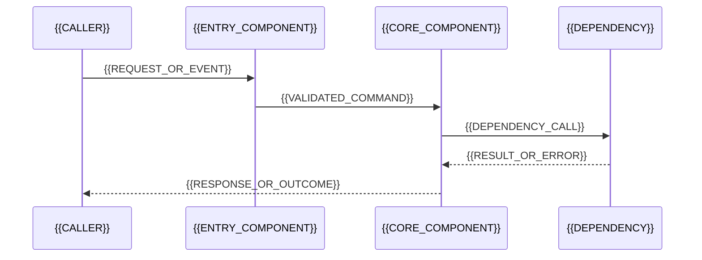

# Design

## Design Summary

{{RECOMMENDED_SOLUTION_AND_WHY_IT_SOLVES_THE_PROBLEM}}

## Scope and Constraints

- In scope: {{DESIGN_SCOPE}}
- Out of scope: {{EXPLICIT_NON_GOALS}}
- Constraints: {{TECHNICAL_PRODUCT_SECURITY_OR_DELIVERY_CONSTRAINTS}}
- Assumptions: {{MATERIAL_ASSUMPTIONS_REQUIRING_CONFIRMATION}}

## Current State

Describe the current path with repository evidence, existing owners, dependencies, and the failure or limitation being changed.

- Entry points: `{{CURRENT_ENTRY_POINTS}}`
- Current owners: `{{CURRENT_COMPONENT_OWNERS}}`
- Evidence: `{{RELEVANT_CODE_TEST_SPEC_OR_HISTORY_PATHS}}`

## Architecture and Relationship Topology

Explain the target boundary, direction of dependencies, ownership, and what remains unchanged.

```mermaid
flowchart LR
    Caller[{{CALLER}}] --> Entry[{{ENTRY_COMPONENT}}]
    Entry --> Core[{{DOMAIN_OR_CORE_COMPONENT}}]
    Core --> Port[{{INTERFACE_OR_PORT}}]
    Adapter[{{ADAPTER_OR_INFRASTRUCTURE}}] --> Port
```

## Responsibilities

| Component / module | Responsibility | Depends on | Must not own | Change type |
|---|---|---|---|---|
| `{{COMPONENT}}` | {{RESPONSIBILITY}} | `{{DEPENDENCY}}` | {{BOUNDARY}} | add / modify / unchanged |

## Runtime Flows

Show the main success path and identify validation, authorization, persistence, external calls, and observable failure branches.



## Interfaces and Data

- Inputs and outputs: {{FIELDS_TYPES_NULLABILITY_DEFAULTS_AND_VERSIONING}}
- Validation and errors: {{VALIDATION_RULES_ERROR_SCHEMA_AND_STATUS_MAPPING}}
- Persistence / schema: {{ENTITY_TABLE_INDEX_TRANSACTION_AND_MIGRATION_IMPACT_OR_NOT_APPLICABLE_WITH_REASON}}
- Compatibility: {{CALLER_CONSUMER_AND_BACKWARD_COMPATIBILITY_IMPACT}}

## Quality and Operations

- Security and permissions: {{AUTHORIZATION_TRUST_BOUNDARIES_AND_SENSITIVE_DATA_OR_NOT_APPLICABLE_WITH_REASON}}
- Reliability: {{IDEMPOTENCY_RETRY_TIMEOUT_CONCURRENCY_AND_FAILURE_HANDLING}}
- Observability: {{LOGS_METRICS_TRACES_AUDIT_AND_CORRELATION}}
- Performance and capacity: {{LATENCY_VOLUME_CACHING_AND_RESOURCE_IMPACT_OR_NOT_APPLICABLE_WITH_REASON}}
- UX / accessibility: {{LOADING_EMPTY_ERROR_RESPONSIVE_AND_ACCESSIBILITY_BEHAVIOR_OR_NOT_APPLICABLE_WITH_REASON}}

## Delivery and Rollback

- Implementation order: {{ORDERED_INCREMENTAL_STEPS_AND_DEPENDENCIES}}
- Migration / rollout: {{DATA_CONFIG_FEATURE_FLAG_OR_DEPLOYMENT_SEQUENCE_OR_NOT_APPLICABLE_WITH_REASON}}
- Rollback: {{CODE_DATA_CONFIG_AND_CONTRACT_ROLLBACK_PLAN}}
- Stop conditions: {{SIGNALS_THAT_BLOCK_OR_REVERSE_DELIVERY}}

## Decisions and Alternatives

### D1: {{DECISION_TITLE}}

- Choice: {{CHOSEN_OPTION}}
- Reason: {{WHY_THIS_OPTION_BEST_FITS_THE_EVIDENCE_AND_CONSTRAINTS}}
- Alternatives: {{REJECTED_OPTIONS_AND_TRADE_OFFS}}
- Consequences: {{POSITIVE_AND_NEGATIVE_CONSEQUENCES}}
- Owner: {{MODULE_OR_COMPONENT}}

## Verification Strategy

| Risk / acceptance criterion | Verification level | Exact command or evidence | Expected result |
|---|---|---|---|
| {{RISK_OR_BEHAVIOR}} | unit / contract / integration / build / manual | `{{EXACT_COMMAND_OR_EVIDENCE_SOURCE}}` | {{OBSERVABLE_PASS_CONDITION}} |

## Risks and Open Questions

| ID | Risk or question | Impact | Recommendation / mitigation | Blocks implementation? |
|---|---|---|---|---|
| R1 | {{RISK_OR_OPEN_QUESTION}} | {{IMPACT}} | {{RECOMMENDATION_OR_MITIGATION}} | yes / no |

## Developer Confirmation

Implementation must not start until the developer explicitly confirms the material choices and all blocking questions are resolved.

- [ ] C1 Confirm the recommended architecture and component boundaries in D1.
- [ ] C2 Confirm interface, data, compatibility, and migration choices.
- [ ] C3 Confirm delivery, rollback, verification, and accepted residual risks.
- [ ] C4 Resolve every item marked as blocking in Risks and Open Questions.
